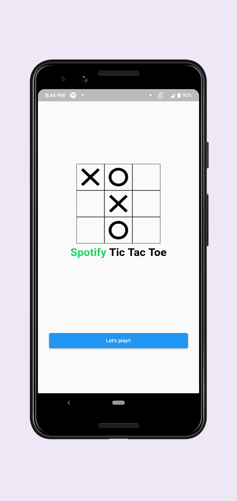
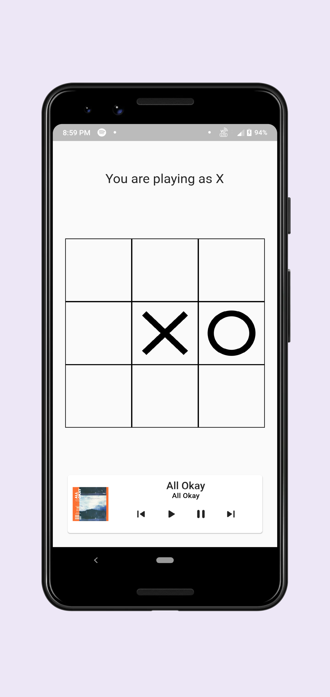
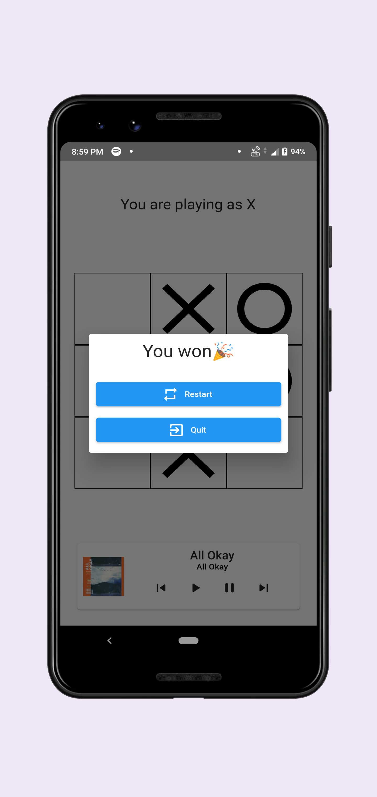

# Tic Tac Toe with Spotify

This a project to integrate spotify into a flutter app.

Main Screen | Game Screen | End Screen
---|---|---
 |  | 

### Build

1. Signup for spotify account at [developer portal](https://developer.spotify.com/dashboard/).
2. Run `cp .\lib\api_keys.example.dart .\lib\api_keys.dart`
3. Replace your client ID.
4. Run `flutter build apk`
